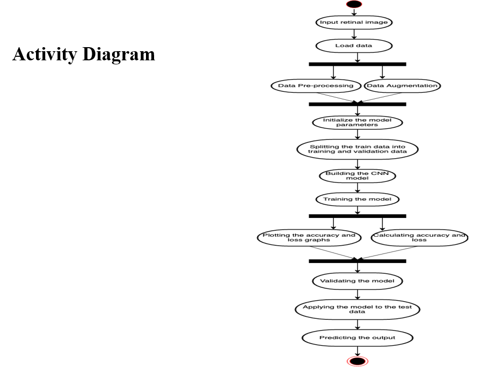
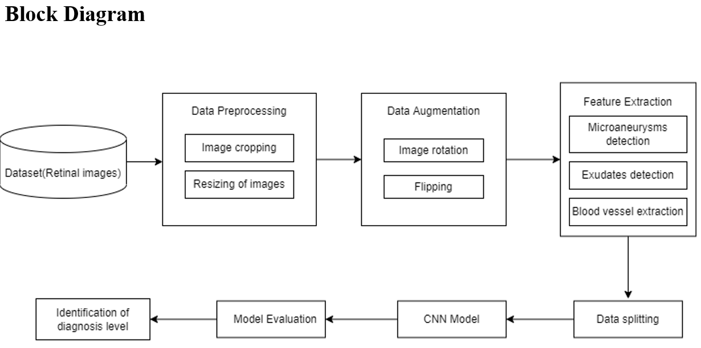
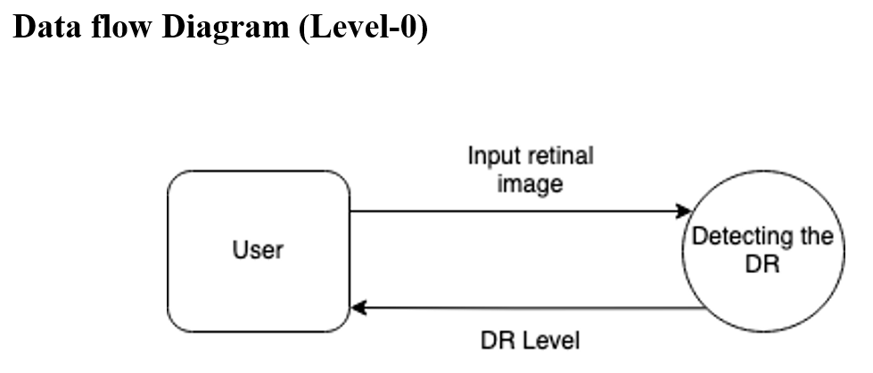
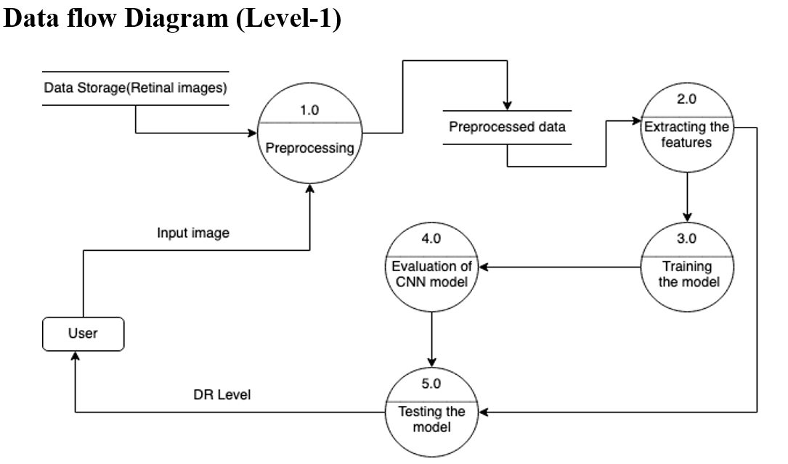
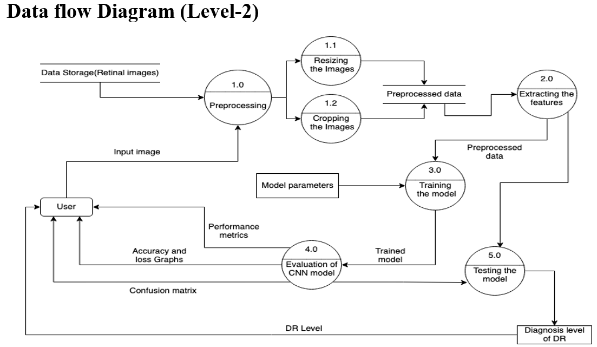
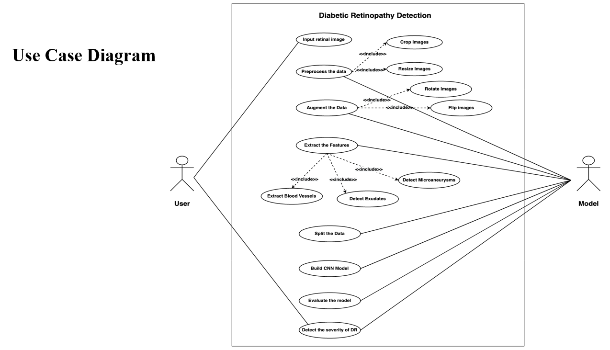

# Diabetic Retinopathy Detection using Deep Learning

---

## Project Overview

This project investigates the application of **deep learning–based computer vision techniques** for the **automatic detection and severity classification of Diabetic Retinopathy (DR)** from retinal fundus images. Diabetic Retinopathy is a diabetes-related ocular disease that progressively damages the retina and can lead to irreversible blindness if not detected at an early stage.

The motivation for this work arises from the limitations of manual screening procedures, which are **time-consuming, subjective, and difficult to scale**, especially in regions with limited access to ophthalmologists. The objective of this project is to design and evaluate a **robust, reproducible, and scalable machine learning pipeline** capable of classifying retinal images into clinically defined DR severity levels.

---

## Problem Statement

Diabetic Retinopathy screening traditionally relies on expert interpretation of fundus images. This process faces several challenges:

- Lack of visible symptoms in early stages of the disease  
- High dependence on trained specialists  
- Variability due to subjective interpretation  
- Limited scalability for population-level screening  

From a machine learning perspective, the problem is formulated as a **multi-class image classification task** with five severity levels. The task is further complicated by **class imbalance**, **subtle inter-class visual differences**, and the **ordinal nature of disease progression**.

---

## Dataset Description

- **Dataset**: APTOS 2019 Blindness Detection (Kaggle)  
- **Training samples**: 3,662 retinal fundus images  
- **Test samples**: 1,928 retinal fundus images  
- **Classes**:
  - 0 – No Diabetic Retinopathy  
  - 1 – Mild DR  
  - 2 – Moderate DR  
  - 3 – Severe DR  
  - 4 – Proliferative DR  
- **Image type**: High-resolution color fundus photographs  

The dataset reflects real-world clinical distributions and is **highly imbalanced**, with a majority of samples belonging to the “No DR” class. This characteristic was preserved to ensure realistic evaluation.

---

## Methodology

### Data Preprocessing

- Image normalization (pixel values scaled to [0, 1])  
- Resizing images to a fixed resolution (728 × 728 × 3)  
- Removal of invalid or corrupted images  
- Label formatting for categorical classification  

### Data Augmentation

- Horizontal flipping  
- Train–validation split (80% / 20%)  
- Augmentation used as a regularization strategy to improve generalization  

---

## System Workflow (Activity Diagram)

The activity diagram illustrates the complete operational workflow of the proposed system. It captures the sequence of operations from retinal image acquisition to final DR severity prediction.

  

The workflow includes data loading, preprocessing, augmentation, model initialization, training, performance evaluation, validation, and final testing to generate the diagnosis output.

---

## System Architecture (Block Diagram)

The block diagram presents a high-level architectural view of the system and highlights the major processing stages involved in the pipeline.

  

It illustrates how retinal images pass through preprocessing, augmentation, feature extraction, data splitting, CNN model training, evaluation, and final diagnosis level identification.

---

## Data Flow Diagrams

### Level 0 Data Flow Diagram

The Level-0 Data Flow Diagram represents the system as a single black-box process. It emphasizes the interaction between the user and the system, where the user provides a retinal image and receives the predicted DR level as output.

  

---

### Level 1 Data Flow Diagram

The Level-1 Data Flow Diagram decomposes the system into major functional modules such as preprocessing, feature extraction, training, evaluation, and testing.

  

This level provides insight into how data flows between the primary processing components.

---

### Level 2 Data Flow Diagram

The Level-2 Data Flow Diagram provides a detailed expansion of internal operations, including image resizing, cropping, model parameter initialization, performance metric computation, and confusion matrix generation.

  

This diagram offers a fine-grained view of data movement across sub-processes and evaluation stages.

---

## Use Case Diagram

The use case diagram illustrates the functional interactions between the user and the Diabetic Retinopathy detection system.

  

It highlights system capabilities such as preprocessing, data augmentation, feature extraction, model training, evaluation, and DR severity detection, emphasizing modular system design.

---

## Model Architectures

The project evaluates multiple **transfer learning–based CNN architectures**, all pretrained on ImageNet and fine-tuned on the DR dataset.

### ResNet50
- Residual connections to mitigate vanishing gradients  
- Global Average Pooling followed by fully connected layers  
- Used as a baseline architecture  

### ResNet50 + VGG16 (Ensemble)
- Combines residual learning with deep convolutional feature extraction  
- Improves convergence and validation accuracy  

### ResNet50 + Xception (Final Model)
- Employs depthwise separable convolutions  
- Better captures fine-grained retinal features  
- Achieved the best overall performance  

---

## Training Strategy

- Transfer learning using ImageNet-pretrained weights  
- Two-phase training:
  - Warm-up phase with frozen backbone layers and higher learning rate  
  - Fine-tuning phase with unfrozen layers and reduced learning rate  
- Optimization techniques:
  - Adam optimizer  
  - Early stopping  
  - ReduceLROnPlateau learning rate scheduling  
- Reproducibility ensured via fixed random seeds  

---

## Evaluation Metrics

Model performance was evaluated using:

- Accuracy  
- Precision, Recall, and F1-Score (class-wise)  
- Confusion Matrix  
- Quadratic Cohen’s Kappa Score (for ordinal severity evaluation)  

---

## Results

| Model | Accuracy |
|------|----------|
| ResNet50 | 0.49 |
| ResNet50 + VGG16 | 0.66 |
| ResNet50 + Xception | **0.72** |

The ensemble of ResNet and Xception demonstrated superior generalization, reduced validation loss, and improved classification consistency.

---

## Tools and Technologies Used

### Programming Language
- Python  

### Deep Learning Frameworks
- TensorFlow  
- Keras  

### Data Processing and Visualization
- NumPy  
- Pandas  
- OpenCV  
- Matplotlib  
- Seaborn  

### Evaluation Utilities
- scikit-learn  

### Development Environment
- Google Colab (GPU-accelerated)  

---

## Limitations

- Class imbalance affects recall for severe DR stages  
- Categorical loss does not explicitly model ordinal severity relationships  
- High-resolution images increase computational cost  
- Not optimized for edge or mobile deployment  

---

## Future Scope

- Ordinal regression–based loss functions  
- Class-weighted or focal loss  
- Lightweight architectures (MobileNet, EfficientNet)  
- Attention mechanisms for lesion localization  
- Larger multi-institutional datasets  

---

## Conclusion

This project demonstrates a **systematic, research-oriented application of deep learning** to a clinically relevant medical imaging problem. Through architectural comparison, transfer learning, and rigorous evaluation, the work highlights both the potential and limitations of CNN-based Diabetic Retinopathy detection systems, emphasizing reproducibility, methodological clarity, and evaluation rigor.

